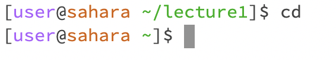
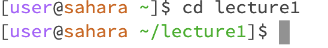
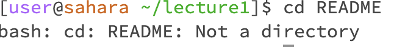
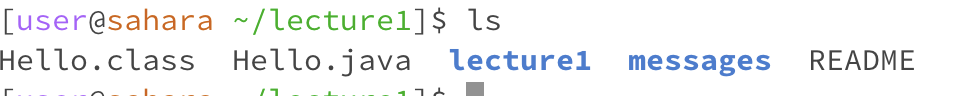
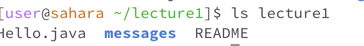
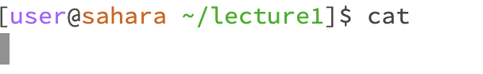
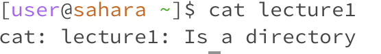

cd:

cd with no argument, 
when we call "cd" with no specific argument it means that we are calling something like the "default directory", or home directory. When we run the cd command, it doesn't output anything. We can use cd as a great tool to take us back to the original starting directory from wherever we are in the system.

cd with directory argument, 
when we call "cd" with a specific directory, in this case, the lecture1 directory, we are moving to the lecture1 directory from wherever we are initially. There was no output produced, but once I called lecture1 as the argument, the path changed from "user@sahara~" to "user@sahara!lecture1", which indicates an update in the directory we are in. In this scenario, my system is at default, which is home. I think of cd as like a guide, it takes us to the directory we command it to..

cd with a file argument, 
cd is short for "change directory", therefore when we only input a file as its argument we would get an error message that says "No such file or directory" because for the cd command to process, we would need to give it directory argument path, a file argument is not sufficient for this command. .

ls:

ls with no argument, 
when we call "ls" it will give us a content list in our current directory. It is like a map, it shows and tells us the file names, and the directories in our current directory. When we don't input any argument into the ls command, it will automatically assume that we are asking for the information (filenames and directories) in the current directory. .

ls with directory argument,
as mentioned above, ls will give us a map-like preview of the filenames and directories in whatever directory we input as the argument. For example, in this scenario, I called lecture1 as my argument with the ls command. Therefore, as we run the command with the "lecture1" argument, we will receive the filename and directory information in the "lecture1" directory. In this case, the output we got was "Hello.java messages README"; the three files in the lecture1 directory. While we are in a system, adding a directory argument after the ls command can allow us to look through the content of the designated directory other than the one we are in..

ls with a file argument, 
in this scenario, I called the "README" file as the argument for the ls command. However, since ls is meant to list out the filenames and content in a specific directory, calling the ls command with a file argument doesn't produce any output besides the filename itself. In this scenario, I called "README" as the argument, so my output from the ls command is also "README". Usually, we would use ls with a directory argument, rather than a file argument, but it is compilable but not as useful. .

cat:

cat with no argument, the cat command gives us the content of the file or files of the path we input in the argument. However, in this case, we are not inputting any argument into the cat command, so the compile process is a bit weird because we gave the cat command, but we aren't finished calling it because we didn't input any path for it. Therefore as shown in the image there is no output, no nothing. The command is just sitting and waiting for us to give further instructions (a specific path). Once I enter cat with no argument there seems to be an error in the system because I cannot enter other commands and have to restart the whole terminal. .

cat with directory argument,
cat command will print out the content of files according to the path we enter as the argument. In this case, we are assigning a specific directory to the cat command, therefore when we call the directory "lecture1" as the argument for the cat command, the system outputs "Is a directory" because our path is now in default /home, but it doesn't provide any content within the files themselves. On the other hand, if we are in the lecture1 directory when we call "cat lecture1" then our output would be cat: lecture1: No such file or directory because we are calling a directory while we are already in it. .

cat with a file argument,
In order for us to us cat and successfully call a file with its content, it is crucial for us to be inside the desired directory beforehand. In this example, we are already in the "lecture1" directory, so we can call the file "README" as the argument for the cat command because the "README" file is part of the lecture1 directory. However, if I was to call the "en-us.txt" file, then I'd have to cd into the "message" directory first before I can cat the "en-us.txt" file because it is in a different directory than we are at the moment in this example. ![Image}(cat with directory argument.png).
